# System Architecture — GPanel

## Overview

GPanel is a church management system designed to connect human users, web interfaces, authentication, backend services, external integrations, AI services, and persistent data storage into a single application architecture.

The system separates responsibilities between the frontend, authentication layer, protected backend APIs, church business services, data adapters, and database providers.

The architecture is designed around a clear request flow:

```text
Human
  ↓
Web / Frontend
  ↓
Authentication
  ↓
JWT
  ↓
Protected API
  ↓
Controller
  ↓
Church Service
  ↓
Data Adapter
  ↓
Database
```

The WhatsApp integration follows a separate event-driven path:

```text
WhatsApp
  ↓
Baileys
  ↓
BotService
  ├── AI Service
  ├── Jemaat Lookup
  └── Data Adapter
```

---

## Human Interaction

Humans are the primary actors of the system.

A human can access GPanel through a web browser and interact with the public website, authentication pages, administrative dashboard, or member portal.

The main interaction begins when a user opens the Gereja web application.

```text
Human
  ↓
Gereja Web
  ↓
Public / Landing Page
  ├── Login
  └── Register
```

After successful authentication, the human receives access to the authenticated frontend.

The frontend exposes functionality according to the user's identity, tenant, role, and permissions.

Typical functionality includes:

- Jemaat management
- Keluarga management
- Pelayan management
- Jadwal
- Absensi
- Keuangan
- Inventaris
- Notifikasi
- Settings
- User management
- WhatsApp management

Humans do not directly access the database. All application data access is performed through backend services and the data access layer.

---

## Web / Frontend

The web application is the primary interface between humans and the backend.

The frontend contains:

- Public landing page
- Login page
- Registration page
- Authentication context
- Browser authentication storage
- Admin dashboard
- Member portal
- Feature pages
- API client

The frontend uses the API client to communicate with backend APIs.

```text
Frontend
  ↓
API Client
  ↓
HTTP / REST
  ↓
Backend API
```

The frontend should not directly access TypeORM, SQLite, Supabase, or other database implementations.

This keeps database implementation details inside the backend.

---

## Authentication

Authentication is handled through the Authentication API.

The primary authentication flow is:

```text
Login Page
  ↓
API Client
  ↓
POST /auth/login
  ↓
AuthController
  ↓
AuthService
  ├── UsersService
  ├── Password Verification
  └── JwtService
          ↓
        JWT
          ↓
     Auth Context
```

Password verification is performed by the authentication service using the configured password hashing mechanism.

After successful authentication, the backend generates a JWT.

The frontend stores the authentication state and uses the token for subsequent authenticated requests.

---

## Session Restoration

When an authenticated user returns to the application, the frontend can restore the existing authentication state.

```text
Browser Auth Storage
  ↓
Auth Context
  ↓
API Client
  ↓
GET /auth/profile
  ↓
AuthGuard
  ↓
JwtStrategy
  ↓
UsersService
  ↓
Verified User
  ↓
Authenticated Frontend
```

This allows the frontend to determine whether the existing authentication state is still valid.

---

## Protected API

After authentication, feature requests are sent to protected backend APIs.

The protected request pipeline is:

```text
Frontend
  ↓
API Client
  │
  │ Authorization: Bearer JWT
  ↓
JWT Authentication Guard
  ↓
Verify JWT
  ↓
Resolve User Identity
  ↓
Tenant Guard
  ↓
Role / Permission Guard
  ↓
Protected API
```

The protected API layer contains endpoints such as:

```text
/jemaat
/keluarga
/pelayan
/jadwal
/absensi
/keuangan
/inventaris
/notif
/settings
/users
/wa/*
```

The JWT establishes the authenticated identity.

The tenant layer determines which church or tenant the request belongs to.

The role and permission layer determines whether the authenticated identity is allowed to perform the requested operation.

---

## Controller Layer

Each protected API is connected to its corresponding controller.

```text
/jemaat
  ↓
JemaatController
  ↓
JemaatService
```

```text
/keluarga
  ↓
KeluargaController
  ↓
KeluargaService
```

```text
/pelayan
  ↓
PelayanController
  ↓
PelayanService
```

The same pattern is applied to the other church modules.

Controllers are responsible for handling API requests and passing the request into the appropriate business service.

Controllers should not contain database implementation details.

---

## Church Services

Church services contain the business logic for each functional domain.

Examples include:

- `JemaatService`
- `KeluargaService`
- `PelayanService`
- `JadwalService`
- `AbsensiService`
- `KeuanganService`
- `InventarisService`
- `NotifikasiService`
- `SettingsService`
- `UsersService`
- `BotService`

The general flow is:

```text
Controller
  ↓
Service
  ↓
Data Adapter
```

This separation allows business logic to remain independent from the underlying database provider.

For example:

```text
JemaatController
  ↓
JemaatService
  ↓
Jemaat Data Adapter
```

The same architecture can be extended with additional church modules without changing the overall backend structure.

---

## UsersService

`UsersService` is a shared backend service.

It is not a separate service for authentication and another separate service for user management.

Authentication-related functionality and the protected user API can both use the same `UsersService`.

```text
AuthService
     │
     ▼
UsersService
     ▲
     │
UsersController
```

`JwtStrategy` can also use `UsersService` when resolving the authenticated user.

This keeps user-related business logic centralized.

---

## Data Adapter Layer

The service layer does not directly depend on a specific database implementation.

Instead, services communicate through data adapters.

```text
Church Service
  ↓
Data Adapter
  ↓
Database Provider
```

The architecture contains individual adapters for domain-specific data and a common repository/data adapter layer.

Examples include:

- Jemaat Data Adapter
- Keluarga Data Adapter
- Pelayan Data Adapter
- Jadwal Data Adapter
- Absensi Data Adapter
- Keuangan Data Adapter
- Inventaris Data Adapter
- Notifikasi Data Adapter
- Settings Data Adapter
- Users Data Adapter
- Common / Repository Adapter

This abstraction makes it possible to switch database implementations without rewriting the business services.

---

## Database Provider Selection

The final database provider is selected through the `FITUR_DB` configuration.

```text
Data Adapter
     ↓
  FITUR_DB?
    ├── true
    │     ↓
    │  TypeORM Adapter
    │     ↓
    │  TypeORM
    │     ↓
    │  main_database.db
    │
    └── false
          ↓
       Supabase Adapter
          ↓
       SupabaseService
          ↓
       Supabase
```

When `FITUR_DB` is enabled, the application uses the TypeORM path and stores data in the local SQLite database:

```text
main_database.db
```

When `FITUR_DB` is disabled, the application uses the Supabase adapter and `SupabaseService` to communicate with Supabase.

The services remain independent from this implementation choice because the adapter layer hides the underlying provider.

---

## WhatsApp Architecture

WhatsApp is handled separately from normal browser requests.

The WhatsApp connection uses Baileys and communicates with `BotService`.

```text
WhatsApp
  ↕
Baileys
  ↕
BotService
```

The important distinction is that WhatsApp events do not originate from the web frontend.

The normal web path is:

```text
Frontend
  ↓
HTTP API
  ↓
BotController
  ↓
BotService
```

The WhatsApp event path is:

```text
WhatsApp
  ↓
Baileys
  ↓
BotService
```

Therefore, `BotController` is used for HTTP/API operations related to the bot, while `BotService` handles the actual bot logic and WhatsApp events.

---

## WhatsApp Session

The WhatsApp session is maintained by the backend through the Baileys integration.

The session is connected to `BotService`.

```text
WhatsApp
  ↕
Baileys
  ↕
BotService
  ↓
Session Handling
  ↓
Data Adapter
  ↓
Database
```

This allows WhatsApp authentication/session information to be persisted rather than being treated purely as temporary runtime state.

The session data can therefore follow the same database abstraction used by the rest of the backend.

```text
BotService
  ↓
Session Service / Session Repository
  ↓
Data Adapter
  ↓
FITUR_DB
  ├── TypeORM
  │     ↓
  │  main_database.db
  │
  └── Supabase
```

---

## WhatsApp and Church Data

The bot can access church data through existing backend services.

For example:

```text
WhatsApp
  ↓
Baileys
  ↓
BotService
  ↓
JemaatService
  ↓
Jemaat Data Adapter
  ↓
Database
```

This prevents the WhatsApp bot from directly accessing database implementations.

The bot instead uses the same service and data-access architecture as the rest of the application.

---

## AI Integration

The WhatsApp bot can communicate with the AI service.

```text
BotService
  ↓
AI Service
  ↓
Local AI Model
```

The AI service is responsible for AI-related processing, while `BotService` remains responsible for the bot workflow.

A typical message flow is:

```text
WhatsApp
  ↓
Baileys
  ↓
BotService
  ├── Jemaat Lookup
  ├── AI Service
  │      ↓
  │   Local AI Model
  │
  └── Data Adapter
  ↓
Baileys
  ↓
WhatsApp Reply
```

---

## SSO

The architecture also provides an SSO path.

```text
SSO Client
  ↓
POST /auth/sso-login
  ↓
SSO Service
  ↓
SSO Token Validation
  ↓
Local JWT
  ↓
Auth Context
```

The resulting local JWT allows the authenticated frontend to use the same protected API pipeline as a normal login.

```text
Local JWT
  ↓
API Client
  ↓
JWT Guard
  ↓
Tenant Guard
  ↓
Role / Permission Guard
  ↓
Protected API
```

---

## Public and Protected Endpoints

Authentication bootstrap endpoints are treated separately from protected application APIs.

Public authentication endpoints include:

```text
/auth/login
/auth/register
```

These endpoints are required before a user has an authenticated JWT.

After authentication, feature APIs require the authenticated request pipeline.

```text
Public
  ↓
/auth/login
  ↓
JWT
  ↓
Protected API
```

This distinction prevents the normal application endpoints from being treated as unauthenticated public resources.

---

## Architecture Principles

The architecture follows several separation-of-concern principles:

### 1. Humans interact through the frontend

Humans do not directly access backend services or databases.

### 2. Authentication happens before protected application access

A user authenticates first and receives a JWT before accessing protected APIs.

### 3. Authorization happens after authentication

JWT verification establishes identity, while tenant and role/permission checks determine access.

### 4. Controllers handle API boundaries

Controllers receive HTTP/API requests and delegate business operations to services.

### 5. Services contain business logic

Church services represent the application's functional domains.

### 6. Data adapters isolate database implementations

Services do not need to know whether data is stored using TypeORM/SQLite or Supabase.

### 7. WhatsApp is an independent event source

WhatsApp messages enter through Baileys and are handled by `BotService`.

### 8. AI is a service dependency

The bot can invoke AI processing without making the AI model responsible for WhatsApp transport or database access.

### 9. Database selection is abstracted

The `FITUR_DB` configuration determines the database path while keeping the higher application layers independent from the selected provider.

---

## Complete Request Model

The complete authenticated web request can be summarized as:

```text
Human
  ↓
Web Browser
  ↓
Gereja Web
  ↓
Authenticated Frontend
  ↓
API Client
  ↓
Bearer JWT
  ↓
JWT Authentication Guard
  ↓
JWT Verification
  ↓
User Identity
  ↓
Tenant Guard
  ↓
Role / Permission Guard
  ↓
Protected API
  ↓
Controller
  ↓
Church Service
  ↓
Data Adapter
  ↓
FITUR_DB
  ├── TypeORM
  │     ↓
  │  main_database.db
  │
  └── Supabase
        ↓
     Supabase
```

The resulting architecture keeps the human-facing interface, authentication, authorization, business logic, integrations, and persistence layers separated while allowing them to operate as one system.

---

## Architecture Diagram

The complete Mermaid architecture diagram is maintained below.

```mermaid

flowchart TD

%% =========================================================
%% USER
%% =========================================================

user(("Church User"))

%% =========================================================
%% WEB / FRONTEND
%% =========================================================

subgraph web["WEB / BROWSER"]

    website["Gereja Web"]

    landing["Public / Landing Page"]

    login["Login Page"]
    register["Register Page"]

    authctx["Auth Context<br/>auth-context.tsx"]

    storage["Browser Auth Storage<br/>localStorage / cookie"]

    frontend["Authenticated Frontend"]

    admin["Admin Dashboard"]

    portal["Member Portal"]

    pages["Feature Pages<br/>
    Jemaat<br/>
    Keluarga<br/>
    Pelayan<br/>
    Jadwal<br/>
    Absensi<br/>
    Keuangan<br/>
    Inventaris<br/>
    Notifikasi<br/>
    Settings"]

    apiclient["API Client<br/>api.ts / Axios"]

    website --> landing

    landing --> login
    landing --> register

    login --> authctx
    register --> authctx

    authctx --> storage
    storage --> authctx

    authctx --> frontend

    frontend --> admin
    frontend --> portal

    admin --> pages
    portal --> pages

    pages --> apiclient

end

user -->|"1. Open website"| website


%% =========================================================
%% AUTHENTICATION API
%% =========================================================

subgraph auth_layer["AUTHENTICATION API"]

    authapi["Auth API<br/>/auth/*"]

    loginapi["POST /auth/login"]
    registerapi["POST /auth/register"]

    authcontroller["AuthController"]

    authservice["AuthService"]

    authuserservice["UsersService"]

    password["bcrypt<br/>Password Hash / Verify"]

    jwtservice["JwtService<br/>Create JWT"]

    profileapi["GET /auth/profile"]

    authguard["AuthGuard('jwt')"]

    jwtstrategy["JwtStrategy"]

    authapi --> loginapi
    authapi --> registerapi

    loginapi --> authcontroller
    registerapi --> authcontroller

    authcontroller --> authservice

    authservice --> users_service
    authservice --> password
    authservice --> jwtservice

    profileapi --> authguard
    authguard --> jwtstrategy
    jwtstrategy --> users_service

end


%% =========================================================
%% LOGIN / REGISTER FLOW
%% =========================================================

login -->|"credentials"| apiclient
register -->|"registration data"| apiclient

apiclient -->|"HTTP / REST"| authapi

loginapi -->|"validate credentials"| authservice
registerapi -->|"create account"| authservice

authservice -->|"JWT token"| authctx

authctx -->|"save token"| storage


%% =========================================================
%% SESSION RESTORE
%% =========================================================

storage -->|"existing JWT"| authctx

authctx -->|"restore session"| apiclient

apiclient -->|"Authorization: Bearer JWT"| profileapi

profileapi --> authguard
authguard --> jwtstrategy

jwtstrategy -->|"verified user"| authctx


%% =========================================================
%% BACKEND / NESTJS SECURITY
%% =========================================================

subgraph backend["BACKEND — NESTJS"]

    nest["NestJS Application"]

    jwt_guard["JWT Authentication Guard"]

    verifyjwt["Verify JWT<br/>Signature + Expiration"]

    identity["Resolve User Identity<br/>req.user"]

    tenantguard["Tenant Guard<br/>tenantId"]

    roleguard["Role / Permission Guard"]

    nest --> jwt_guard

    jwt_guard --> verifyjwt
    verifyjwt --> identity
    identity --> tenantguard
    tenantguard --> roleguard

end


%% =========================================================
%% FRONTEND → PROTECTED BACKEND
%% =========================================================

frontend -->|"feature request"| apiclient

apiclient -->|"Authorization: Bearer JWT"| jwt_guard


%% =========================================================
%% PROTECTED API
%% =========================================================

subgraph protected["PROTECTED API"]

    pjemaat["/jemaat"]
    pkeluarga["/keluarga"]
    ppelayan["/pelayan"]
    pjadwal["/jadwal"]
    pabsensi["/absensi"]
    pkeuangan["/keuangan"]
    pinventaris["/inventaris"]
    pnotif["/notif"]
    psettings["/settings"]
    pusers["/users"]
    pwa["/wa/*"]

end


%% =========================================================
%% ROLE GUARD → PROTECTED API
%% =========================================================

roleguard --> pjemaat
roleguard --> pkeluarga
roleguard --> ppelayan
roleguard --> pjadwal
roleguard --> pabsensi
roleguard --> pkeuangan
roleguard --> pinventaris
roleguard --> pnotif
roleguard --> psettings
roleguard --> pusers
roleguard --> pwa


%% =========================================================
%% CONTROLLERS
%% =========================================================

subgraph controllers["CONTROLLERS"]

    jemaat_controller["JemaatController"]
    keluarga_controller["KeluargaController"]
    pelayan_controller["PelayanController"]
    jadwal_controller["JadwalController"]
    absensi_controller["AbsensiController"]
    keuangan_controller["KeuanganController"]
    inventaris_controller["InventarisController"]
    notif_controller["NotifikasiController"]
    settings_controller["SettingsController"]
    users_controller["UsersController"]
    bot_controller["BotController"]

end


%% =========================================================
%% PROTECTED API → CONTROLLERS
%% =========================================================

pjemaat --> jemaat_controller
pkeluarga --> keluarga_controller
ppelayan --> pelayan_controller
pjadwal --> jadwal_controller
pabsensi --> absensi_controller
pkeuangan --> keuangan_controller
pinventaris --> inventaris_controller
pnotif --> notif_controller
psettings --> settings_controller
pusers --> users_controller
pwa --> bot_controller


%% =========================================================
%% CHURCH SERVICES
%% =========================================================

subgraph church["CHURCH SERVICES"]

    jemaat_service["JemaatService"]
    keluarga_service["KeluargaService"]
    pelayan_service["PelayanService"]
    jadwal_service["JadwalService"]
    absensi_service["AbsensiService"]
    keuangan_service["KeuanganService"]
    inventaris_service["InventarisService"]
    notif_service["NotifikasiService"]
    settings_service["SettingsService"]
    users_service["UsersService"]
    bot_service["BotService"]

end


%% =========================================================
%% CONTROLLER → SERVICE
%% =========================================================

jemaat_controller --> jemaat_service
keluarga_controller --> keluarga_service
pelayan_controller --> pelayan_service
jadwal_controller --> jadwal_service
absensi_controller --> absensi_service
keuangan_controller --> keuangan_service
inventaris_controller --> inventaris_service
notif_controller --> notif_service
settings_controller --> settings_service
users_controller --> users_service
bot_controller --> bot_service


%% =========================================================
%% DATA ADAPTER
%% =========================================================

subgraph adapters["DATA ADAPTER"]

    jemaat_adapter["Jemaat Data Adapter"]
    keluarga_adapter["Keluarga Data Adapter"]
    pelayan_adapter["Pelayan Data Adapter"]
    jadwal_adapter["Jadwal Data Adapter"]
    absensi_adapter["Absensi Data Adapter"]
    keuangan_adapter["Keuangan Data Adapter"]
    inventaris_adapter["Inventaris Data Adapter"]
    notif_adapter["Notifikasi Data Adapter"]
    settings_adapter["Settings Data Adapter"]
    users_adapter["Users Data Adapter"]
    common_adapter["Common / Repository Adapter"]

end


%% =========================================================
%% SERVICE → ADAPTER
%% =========================================================

jemaat_service --> jemaat_adapter
keluarga_service --> keluarga_adapter
pelayan_service --> pelayan_adapter
jadwal_service --> jadwal_adapter
absensi_service --> absensi_adapter
keuangan_service --> keuangan_adapter
inventaris_service --> inventaris_adapter
notif_service --> notif_adapter
settings_service --> settings_adapter
users_service --> users_adapter

jemaat_adapter --> common_adapter
keluarga_adapter --> common_adapter
pelayan_adapter --> common_adapter
jadwal_adapter --> common_adapter
absensi_adapter --> common_adapter
keuangan_adapter --> common_adapter
inventaris_adapter --> common_adapter
notif_adapter --> common_adapter
settings_adapter --> common_adapter
users_adapter --> common_adapter


%% =========================================================
%% DATABASE SWITCH
%% =========================================================

subgraph data["DATA ACCESS / DATABASE"]

    dbflag{"FITUR_DB?"}

    typeorm_adapter["TypeORM Adapter"]

    typeorm["TypeORM"]

    sqlite["SQLite<br/>main_database.db"]

    supabase_adapter["Supabase Adapter"]

    supabase_service["SupabaseService"]

    supabase["Supabase"]

    common_adapter --> dbflag

    dbflag -->|"true"| typeorm_adapter
    typeorm_adapter --> typeorm
    typeorm --> sqlite

    dbflag -->|"false"| supabase_adapter
    supabase_adapter --> supabase_service
    supabase_service --> supabase

end


%% =========================================================
%% WHATSAPP / BOT
%% =========================================================

subgraph whatsapp["WHATSAPP / BOT"]

    wa(("WhatsApp"))

    botgateway["WhatsApp Connection<br/>Direct to Backend"]

    baileys["Baileys"]

    session["WhatsApp Session"]

    botmemberlookup["Jemaat Lookup"]

    ai["AI Service"]

    model["Local AI Model"]

    wa -->|"message / event"| botgateway

    botgateway --> bot_controller

    bot_service --> baileys
    baileys --> session
    session --> bot_service

    bot_service --> botmemberlookup
    bot_service --> ai

    ai --> model
    model --> ai

    ai --> bot_service

    bot_service -->|"send reply"| baileys
    baileys -->|"reply"| wa

end


%% =========================================================
%% WHATSAPP DATA
%% =========================================================

botmemberlookup --> jemaat_service

bot_service --> common_adapter


%% =========================================================
%% PUBLIC AUTH
%% =========================================================

subgraph publicauth["PUBLIC AUTH BOOTSTRAP"]

    public_login["/auth/login"]
    public_register["/auth/register"]
    public_sso["SSO verification"]

end

public_login --> loginapi
public_register --> registerapi


%% =========================================================
%% SSO
%% =========================================================

subgraph sso["SSO"]

    ssoclient["SSO Client"]

    ssologin["POST /auth/sso-login"]

    ssoservice["SSO Service"]

    ssotoken["SSO Token Validation"]

    localjwt["Local JWT"]

    ssoclient --> ssologin
    ssologin --> ssoservice
    ssoservice --> ssotoken
    ssotoken --> localjwt

end

localjwt --> authctx
public_sso --> ssotoken


%% =========================================================
%% STYLING
%% =========================================================

classDef user fill:#f8fafc,stroke:#334155,stroke-width:2px,color:#0f172a

classDef frontend fill:#dbeafe,stroke:#2563eb,stroke-width:1.5px,color:#172554

classDef auth fill:#fef3c7,stroke:#d97706,stroke-width:1.5px,color:#78350f

classDef security fill:#ffe4e6,stroke:#e11d48,stroke-width:2px,color:#881337

classDef api fill:#e0f2fe,stroke:#0284c7,stroke-width:1.5px,color:#0c4a6e

classDef service fill:#dcfce7,stroke:#16a34a,stroke-width:1.5px,color:#14532d

classDef adapter fill:#e0e7ff,stroke:#4f46e5,stroke-width:1.5px,color:#312e81

classDef data fill:#ccfbf1,stroke:#0f766e,stroke-width:1.5px,color:#134e4a

classDef bot fill:#fce7f3,stroke:#db2777,stroke-width:1.5px,color:#831843

classDef ai fill:#ede9fe,stroke:#7c3aed,stroke-width:1.5px,color:#4c1d95

classDef public fill:#f1f5f9,stroke:#64748b,stroke-width:1.5px,color:#334155


class user user

class website,landing,login,register,authctx,storage,frontend,admin,portal,pages,apiclient frontend

class authapi,loginapi,registerapi,authcontroller,authservice,password,jwtservice,profileapi,authguard,jwtstrategy auth

class nest,jwt_guard,verifyjwt,identity,tenantguard,roleguard security

class pjemaat,pkeluarga,ppelayan,pjadwal,pabsensi,pkeuangan,pinventaris,pnotif,psettings,pusers,pwa api

class jemaat_controller,keluarga_controller,pelayan_controller,jadwal_controller,absensi_controller,keuangan_controller,inventaris_controller,notif_controller,settings_controller,users_controller,bot_controller auth

class jemaat_service,keluarga_service,pelayan_service,jadwal_service,absensi_service,keuangan_service,inventaris_service,notif_service,settings_service,users_service,bot_service service

class jemaat_adapter,keluarga_adapter,pelayan_adapter,jadwal_adapter,absensi_adapter,keuangan_adapter,inventaris_adapter,notif_adapter,settings_adapter,users_adapter,common_adapter adapter

class dbflag,typeorm_adapter,typeorm,sqlite,supabase_adapter,supabase_service,supabase data

class wa,botgateway,baileys,session,botmemberlookup bot

class ai,model ai

class public_login,public_register,public_sso public

```


